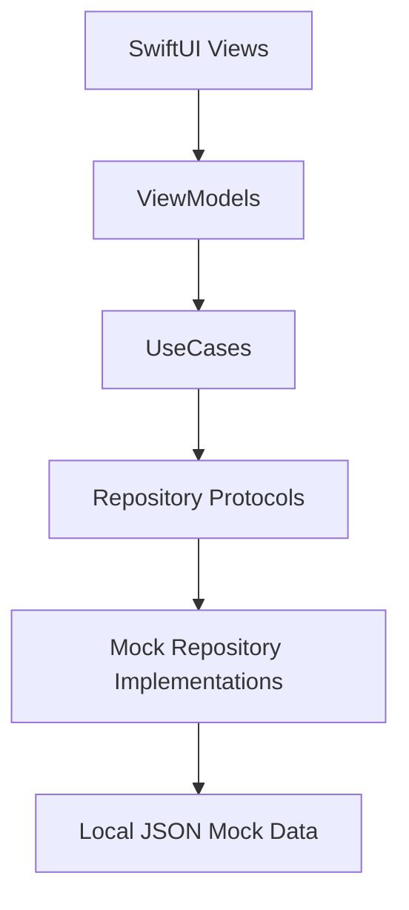
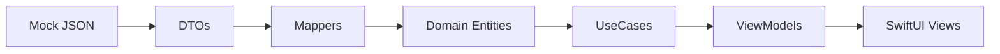
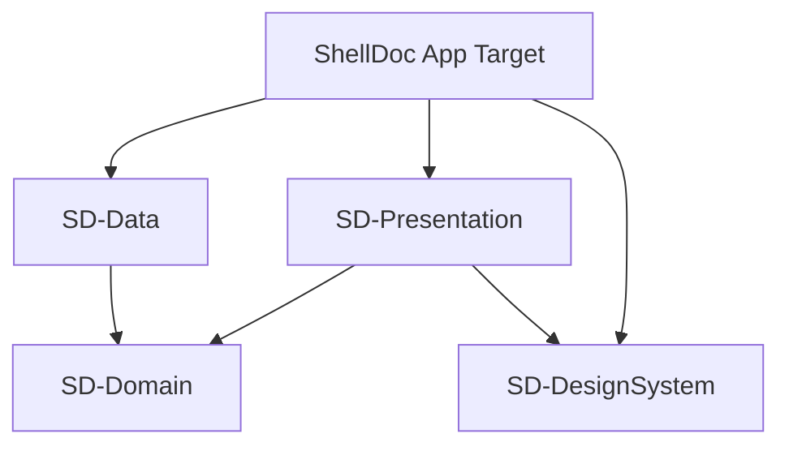
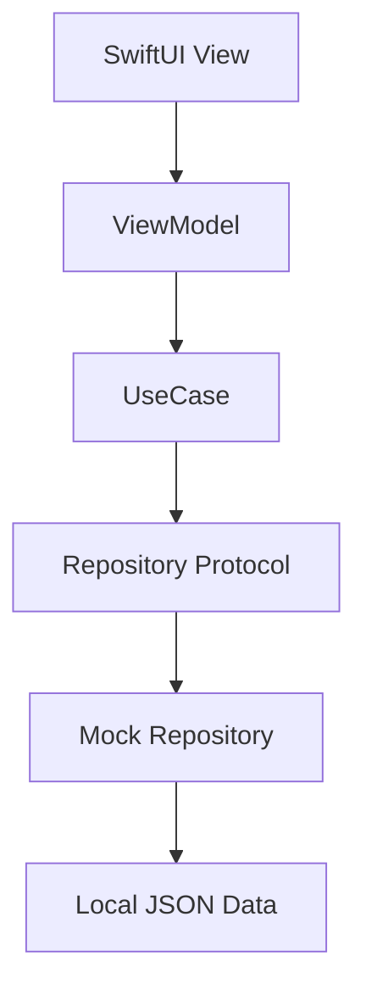

# AI Rules

Before writing code:

1. Read this file.
2. Inspect the Swift Package structure.
3. Confirm the app uses SwiftUI, MVVM and Clean Architecture.
4. Create or update `docs/project-tree.md`.
5. Create or update the Obsidian vault.
6. Create the Domain entities and repository protocols first.
7. Implement mock data through `SD-Data`.
8. Build Presentation using UseCases from `SD-Domain`.
9. Use Atomic Design in `SD-DesignSystem`.
10. Add Mermaid diagrams and development notes.

Do not start from UI only.
Start from Domain and architecture.

---

# Build MVP: ShellDoc — Intelligent Knowledge Platform

You are a Senior SwiftUI Engineer building an MVP for **ShellDoc**, an Intelligent Knowledge Platform for technical documentation.

## Context

ShellDoc is an internal documentation intelligence platform designed to centralize, search, validate and maintain technical/process documentation for Shell App knowledge.

The goal is to prove how a future platform could connect documentation with signals from Jira/Azure DevOps tickets, GitHub commits, GitHub Actions workflows, release notes and Confluence pages.

For this MVP, do **not** connect to real external APIs.

Use local mock JSON data to simulate:

- Confluence documents
- Jira / Azure DevOps tickets
- GitHub commits
- GitHub Actions workflows
- Release notes
- Document ownership
- Document health metadata

The MVP must be functional, demo-ready and built with **SwiftUI puro**.

---

## Platform

Build this as a SwiftUI multiplatform app prepared for:

- iOS
- iPadOS
- macOS
- future Web-oriented experience

Use SwiftUI as the main presentation technology.

Do not use UIKit unless absolutely necessary.

---

## Current Project Structure

The project is organized using Swift Packages as dependencies.

Respect this modular structure:

```txt
DS-Core
├── Sources
│   └── DS-Core
└── Tests
    └── DS-CoreTests

SD-Domain
├── Entities
├── Repositories
├── UseCases
└── Errors

SD-Data
├── DTOs
├── Mappers
├── Repositories
├── Remote
└── Local

SD-Presentation
├── App
├── Navigation
├── Features
│   ├── Auth
│   ├── Dashboard
│   ├── Documents
│   ├── Search
│   ├── Assistant
│   ├── OutdatedReview
│   ├── MockSources
│   ├── Settings
│   └── Profile
└── Shared

SD-DesignSystem
├── Theme
├── Components
├── Modifiers
└── Tokens

ShellDoc
├── ShellDocApp.swift
├── AppContainer.swift
└── AppEnvironment.swift
```

---

## Architecture Rules

Use:

- SwiftUI
- MVVM
- Clean Architecture
- Repository Pattern
- UseCases
- Dependency Injection
- Async/Await
- SwiftData for future local persistence
- Keychain for future token storage
- XCTest for UseCases and ViewModels

Layer dependencies must follow this direction:

```txt
Presentation → Domain ← Data
```

Rules:

- `SD-Domain` must not know about `SD-Presentation` or `SD-Data`.
- `SD-Data` implements repository protocols defined in `SD-Domain`.
- `SD-Presentation` uses UseCases from `SD-Domain`.
- SwiftUI Views must not contain business logic.
- ViewModels prepare state and call UseCases.
- UseCases contain business rules.
- Repositories provide data.
- Mock adapters provide local JSON data for the MVP.

---

## Main Objective

Create a working MVP where users can:

1. Browse documentation.
2. Search documentation contextually.
3. Ask questions to a mock knowledge assistant.
4. See document health status.
5. Detect documents that may be outdated.
6. Understand why a document is flagged as outdated.
7. View related tickets, commits, releases and workflow changes.
8. Generate a mock AI-style update proposal.

The MVP should demonstrate the complete concept without real integrations.

---

## Important Constraint

This is an MVP.

Do not implement:

- Real Confluence API
- Real Jira / Azure DevOps API
- Real GitHub API
- Real GitHub Actions API
- Real authentication
- Real permissions
- Real LLM calls
- Real embeddings
- Real vector database
- Real production database
- Real Shell credentials
- Real secrets

Use mock JSON data only.

---

## Required MVP Features

### 1. Dashboard

Create a Dashboard feature in:

```txt
SD-Presentation/Features/Dashboard
```

The dashboard must show:

- Total documents
- Active documents
- Documents needing review
- Possibly outdated documents
- High-risk documents
- Documents by platform
- Documents by type
- Recent mock activity from tickets, commits and releases

Use reusable Design System components.

---

### 2. Documents Library

Create a Documents feature in:

```txt
SD-Presentation/Features/Documents
```

The library must list all documents from mock JSON.

Each document card should show:

- Title
- Type
- Area
- Platform
- Owner
- Status
- Confidence
- Last validated date
- Next review date
- AI review priority
- Tags

Add filters for:

- Platform
- Type
- Status
- Owner
- Priority
- Tags

Add sorting by:

- Last updated
- Last validated
- Next review
- AI review priority

---

### 3. Document Detail

Create a document detail screen.

It must show:

- YAML-like metadata
- Summary
- Main content
- Related branches
- Related repositories
- Related tools
- Related tickets
- Related commits
- Related releases
- Related workflow changes
- AI update signals
- Open AI questions
- Document health score
- Suggested actions

If the document contains a Mermaid diagram string, show it as plain Markdown/code for now.

Do not implement a complex Mermaid renderer in the MVP unless it already exists.

---

### 4. Search

Create a Search feature in:

```txt
SD-Presentation/Features/Search
```

Implement local search over mock JSON data.

Search should match:

- Title
- Summary
- Content
- Tags
- Platform
- Type
- Related tools
- Related branches
- Related tickets
- Related commits

Add simple semantic-like aliases.

Examples:

```txt
release build -> EoSB1, build generation, versionCodes, GitHub Actions, QA handoff
pilot branch -> extra/pilot, madf/pilot, QA smoke test
localization -> Lokalise, strings.xml, translations
secrets -> Azure Secrets, Keychain, environment values
```

Create a use case:

```swift
SearchKnowledgeUseCase
```

And a domain service or helper if needed.

---

### 5. Knowledge Assistant

Create an Assistant feature in:

```txt
SD-Presentation/Features/Assistant
```

The assistant must be deterministic.

Do not call a real LLM.

The user can ask questions like:

```txt
How does the EoSB1 process work?
What documents may be outdated?
What changed recently in Android release process?
Which documents mention Lokalise?
What are the risks for the EoSB1 process?
Why is this document flagged as possibly outdated?
```

The assistant should:

1. Search documents.
2. Find related signals.
3. Build a structured answer.
4. Cite mock sources used.

Create a use case:

```swift
AnswerQuestionUseCase
```

Return a model like:

```swift
struct AssistantAnswer {
    let summary: String
    let relevantDocuments: [KnowledgeDocument]
    let relatedSignals: [KnowledgeSignal]
    let potentialIssues: [String]
    let suggestedActions: [String]
}
```

---

### 6. Document Health Engine

Create a document health evaluator in Domain.

Suggested location:

```txt
SD-Domain/UseCases/EvaluateDocumentHealthUseCase.swift
```

A document should be flagged as potentially outdated if:

- `nextReview` is in the past.
- `lastValidated` is older than the configured review frequency.
- Related commits touch files mentioned in `aiUpdateSignals`.
- Related tickets were closed after the document was last validated.
- Related release notes mention keywords from the document.
- GitHub Actions workflows changed after the document was last validated.
- Document confidence is low.
- Owner is missing.
- Related branches are missing.
- AI questions are unresolved.

Return:

```swift
struct DocumentHealthResult {
    let healthScore: Int
    let recommendation: DocumentHealthRecommendation
    let reasons: [String]
    let matchedSignals: [KnowledgeSignal]
    let suggestedActions: [String]
}
```

---

### 7. Update Proposal Generator

Create an Outdated Review feature in:

```txt
SD-Presentation/Features/OutdatedReview
```

For a selected document, generate a mock AI-style update proposal.

The proposal should include:

- Current document summary
- Related signals
- Why it may need review
- Potential outdated sections
- Suggested updates
- Open questions
- Confidence level

Create a use case:

```swift
GenerateUpdateProposalUseCase
```

This must be deterministic and based only on mock data.

---

### 8. Mock Sources

Create a Mock Sources feature in:

```txt
SD-Presentation/Features/MockSources
```

It should show:

- Mock documents
- Mock tickets
- Mock commits
- Mock releases
- Mock workflow changes
- Mock owners

This page is important for the demo because it proves the platform is reasoning from simulated source data.

---

## Mock Data

Create local JSON mock files in `SD-Data`.

Suggested location:

```txt
SD-Data/Local/Mock
├── documents.json
├── tickets.json
├── commits.json
├── releases.json
├── workflows.json
└── owners.json
```

Include at least 6 documents:

1. EoSB1 Process for America's App - Android
2. Authentication Flow - Android
3. Rewards Integration Overview
4. Branch Deep Link Handling
5. Lokalise Strings Update Process
6. Azure Secrets Management for Mobile

The EoSB1 document must include:

```txt
Title: EoSB1 Process for America's App - Android
Type: process
Area: Shell App
Platform: Android
Status: active
Confidence: high
Owner: Android Team
Main Contact: Norman Sanchez
Branches:
- develop
- extra/pilot-8.99.0
- madf/pilot
Related tools:
- GitHub
- GitHub Actions
- Lokalise
- Azure DevOps
- Azure Secrets
- Microsoft Teams
AI update signals:
- Changes in build.gradle
- Changes in build.gradle.kts
- Changes in updateconfig.py
- Changes in GitHub Actions workflows
- Changes in Lokalise strings process
- New Azure secrets
- Changes in pilot branch strategy
- Changes in EoSB release process
- Changes in QA smoke test process
```

---

## Domain Models

Create models in:

```txt
SD-Domain/Entities
```

Suggested entities:

```swift
KnowledgeDocument
KnowledgeTicket
RepositoryCommit
ReleaseNote
WorkflowChange
DocumentOwner
KnowledgeSignal
DocumentHealthResult
UpdateProposal
AssistantAnswer
```

Use strong types/enums for:

```swift
DocumentType
DocumentStatus
Platform
ConfidenceLevel
ReviewFrequency
AIReviewPriority
TicketStatus
TicketType
DocumentHealthRecommendation
```

Avoid raw strings in business logic when an enum is better.

---

## Repository Protocols

Define protocols in:

```txt
SD-Domain/Repositories
```

Suggested protocols:

```swift
protocol KnowledgeDocumentRepository {
    func getDocuments() async throws -> [KnowledgeDocument]
    func getDocument(id: String) async throws -> KnowledgeDocument?
}

protocol TicketRepository {
    func getTickets() async throws -> [KnowledgeTicket]
}

protocol RepositorySignalRepository {
    func getCommits() async throws -> [RepositoryCommit]
    func getWorkflowChanges() async throws -> [WorkflowChange]
}

protocol ReleaseRepository {
    func getReleases() async throws -> [ReleaseNote]
}

protocol OwnerRepository {
    func getOwners() async throws -> [DocumentOwner]
}
```

Implement these protocols in `SD-Data`.

---

## Data Layer

In `SD-Data`, create:

```txt
DTOs
Mappers
Repositories
Remote
Local
```

Rules:

- DTOs represent JSON structure.
- Mappers convert DTOs into Domain entities.
- Repositories implement Domain protocols.
- Local contains mock JSON loaders.
- Remote can contain empty/future adapters, but do not connect real APIs yet.

Example:

```txt
SD-Data/DTOs/KnowledgeDocumentDTO.swift
SD-Data/Mappers/KnowledgeDocumentMapper.swift
SD-Data/Repositories/MockKnowledgeDocumentRepository.swift
SD-Data/Local/MockJSONLoader.swift
```

---

## Dependency Injection

Use `AppContainer` and `AppEnvironment` in the main app target.

Suggested responsibility:

```txt
ShellDoc/AppContainer.swift
```

Creates repositories and use cases.

```txt
ShellDoc/AppEnvironment.swift
```

Stores environment configuration like:

- mock mode
- future API mode
- app version
- feature flags

The app must run in mock mode by default.

Do not use third-party DI frameworks.

---

## Presentation Layer

Use MVVM.

Each feature should have:

```txt
FeatureNameView.swift
FeatureNameViewModel.swift
FeatureNameState.swift
```

Example:

```txt
SD-Presentation/Features/Documents
├── DocumentsListView.swift
├── DocumentsListViewModel.swift
├── DocumentsListState.swift
├── DocumentDetailView.swift
├── DocumentDetailViewModel.swift
└── Components
```

ViewModels should:

- Be testable.
- Use async/await.
- Call UseCases.
- Expose simple UI state.
- Avoid direct JSON loading.
- Avoid business rules inside SwiftUI Views.

---

## Design System

Use Atomic Design in:

```txt
SD-DesignSystem
├── Theme
├── Components
├── Modifiers
└── Tokens
```

Validate that reusable UI follows Atomic Design.

Suggested structure:

```txt
SD-DesignSystem/Components
├── Atoms
├── Molecules
├── Organisms
└── Templates
```

Examples:

### Atoms

- SDButton
- SDBadge
- SDText
- SDIcon
- SDScorePill
- SDStatusChip

### Molecules

- SDSearchBar
- SDMetadataRow
- SDFilterChipGroup
- SDHealthScoreRow
- SDSourceCitationRow

### Organisms

- SDDocumentCard
- SDAssistantAnswerCard
- SDHealthPanel
- SDRelatedSignalsPanel
- SDSidebarNavigation
- SDDashboardMetricsSection

### Templates

- SDDashboardTemplate
- SDDocumentDetailTemplate
- SDSearchTemplate
- SDAssistantTemplate

Before creating a new component, check if it belongs to Atoms, Molecules, Organisms or Templates.

Do not duplicate components.

---

## Navigation

Create navigation in:

```txt
SD-Presentation/Navigation
```

The app must include:

- Dashboard
- Documents
- Search
- Assistant
- Outdated Review
- Mock Sources
- Settings
- Profile

Use a navigation approach compatible with iOS, iPadOS and macOS.

Prefer `NavigationStack` and a typed route model.

---

## Obsidian Vault Brain

The project must include an Obsidian-compatible documentation brain.

Create:

```txt
obsidian-vault
├── 00-index
├── 01-product
├── 02-architecture
├── 03-features
├── 04-data-sources
├── 05-ai-rules
├── 06-decisions
├── 07-dev-log
├── 08-diagrams
└── 09-review
```

Every important feature must have an Obsidian note.

Every note must use YAML frontmatter.

Example:

```md
---
title: "Document Health Engine"
type: "feature"
status: "active"
platform: "iOS/iPadOS/macOS"
area: "ShellDoc"
owner: "Product Engineering"
created: 2026-06-04
updated: 2026-06-04
tags:
  - shelldoc
  - health-engine
  - ai-ready
---

# Document Health Engine

## Summary

## Purpose

## Related Files

## Data Flow

## Mermaid Diagram

## Development Notes

## Open Questions
```

---

## Documentation Rules

Before writing or modifying code:

1. Review the project structure.
2. Update or create `docs/project-tree.md`.
3. Add or update the related Obsidian note.
4. Add or update Mermaid diagrams.
5. Then implement the feature.

The project must document:

- Folder tree.
- Architecture.
- Data flow.
- Feature flow.
- Decisions.
- Mock sources.
- Development logs.

---

## Required Diagrams

Create Mermaid diagrams in:

```txt
obsidian-vault/08-diagrams
```

And reference them from related feature notes.

Required diagrams:

### Architecture Diagram



### Data Flow Diagram



### Clean Architecture Diagram



### Feature Flow Diagram

Each major feature must include a small Mermaid diagram.

---

## AI Skill Requirement

When implementing SwiftUI code, follow SwiftUI best practices inspired by:

```txt
https://github.com/AvdLee/SwiftUI-Agent-Skill
```

Rules:

- Keep SwiftUI views small and composable.
- Keep state ownership clear.
- Prefer `@Observable` when appropriate.
- Avoid large View files.
- Extract reusable components into Design System.
- Keep business logic in UseCases.
- Keep ViewModels testable.
- Use previews where useful.
- Use async/await correctly.
- Avoid unnecessary dependencies.

Recommended implementation order:

```txt
1. Domain entity
2. Repository protocol
3. Mock JSON DTO
4. Mapper
5. Mock repository
6. UseCase
7. ViewModel
8. SwiftUI View
9. Design System components
10. Tests
11. Obsidian note
12. Mermaid diagram
```

---

## Testing

Use XCTest.

Add tests for:

- UseCases
- Search logic
- Document health engine
- Update proposal generator
- ViewModels

At minimum, test:

- Search finds EoSB1 when query is "release build".
- Search finds Lokalise process when query is "localization".
- Health engine flags EoSB1 as possibly outdated when `updateconfig.py` changed after last validation.
- Assistant answers with relevant documents and signals.
- Update proposal includes suggested actions and open questions.

---

## Acceptance Criteria

The MVP is complete when:

- The app builds successfully.
- The app runs in mock mode.
- Dashboard shows document health metrics.
- User can browse documents.
- User can open document detail.
- User can search using keywords and semantic-like aliases.
- User can ask mock assistant questions and get structured answers.
- User can see why a document is possibly outdated.
- User can generate a mock update proposal.
- User can inspect mock tickets, commits, releases and workflows.
- Mock JSON data is loaded through `SD-Data`.
- Domain remains independent from Presentation and Data.
- Presentation uses UseCases from Domain.
- Data implements protocols from Domain.
- Atomic Design is respected.
- Obsidian vault exists and contains feature notes.
- Mermaid diagrams exist.
- README explains how the MVP works and how future integrations would replace mock data.

---

## README Requirements

Update `README.md` with:

- What ShellDoc is.
- How to run the app.
- Architecture overview.
- Swift Package structure.
- Mock data explanation.
- How search works.
- How document health detection works.
- How the mock assistant works.
- How update proposals work.
- How the Obsidian vault is used.
- Future integrations.
- Known limitations.

---

## Future Integrations

Add interfaces and structure that make it easy to later connect:

- Confluence API
- Jira API
- Azure DevOps API
- GitHub API
- GitHub Actions API
- Azure OpenAI
- Vector database
- Obsidian Markdown vault
- SharePoint
- SwiftData local cache
- Keychain token storage

Do not implement these integrations in the MVP.

---

## What Not To Do

Do not:

- Build this as a Next.js app.
- Use React or Tailwind.
- Add real APIs.
- Add real credentials.
- Add production auth.
- Hardcode secrets.
- Put business logic in SwiftUI views.
- Make Domain depend on Data or Presentation.
- Duplicate Design System components.
- Skip tests for core logic.
- Skip documentation.
- Skip Mermaid diagrams.
- Skip the Obsidian vault.
- Overengineer the MVP.

---

## Final Goal

The goal is to prove this idea:

> Documentation becomes living knowledge when it is connected to project signals like tickets, commits, releases, workflows and ownership metadata.

ShellDoc should make it easy to find knowledge, understand whether it is reliable, and know what needs to be reviewed next.

---

## Required Skills

When working on this project, the AI agent must use the following skills or reasoning modes when available:

- **SwiftUI Expert Skill**
  - Use for SwiftUI architecture, views, state management, navigation, previews and platform-specific decisions.

- **SwiftUI Agent Skill**
  - Reference: https://github.com/AvdLee/SwiftUI-Agent-Skill
  - Use for SwiftUI best practices, composable views, clear state ownership and clean MVVM implementation.

- **UI/UX Pro Skill**
  - Use for product flows, screen hierarchy, information architecture, interaction patterns, empty states, visual consistency and usability.

- **Caveman / Token-Saving Mode**
  - Use when exploring large files, reviewing architecture or planning changes.
  - Be direct.
  - Avoid unnecessary explanations.
  - Focus on what must be changed, where and why.
  - Do not over-engineer.

- **Humanizer Skill**
  - Use for user-facing copy, onboarding text, assistant responses, empty states and documentation language.
  - The product should feel professional, clear and human, not robotic.

If a skill is not installed or available, the agent must still follow the intent of the skill using its own reasoning.

---

# Mandatory Obsidian Vault Rule

This project must include and maintain an Obsidian-compatible vault called:

```txt
obsidian-vault
```

The vault is the project brain.

Every meaningful change must be reflected in the vault.

The vault must include:

```txt
obsidian-vault
├── 00-index
├── 01-product
├── 02-architecture
├── 03-features
├── 04-data-sources
├── 05-ai-rules
├── 06-decisions
├── 07-dev-log
├── 08-diagrams
└── 09-review
```

The AI agent must document:

- What was built.
- Why it exists.
- Where the files live.
- How the feature works.
- Which Domain models, UseCases, repositories and ViewModels are involved.
- Which mock data files are used.
- Which Atomic Design components were added or reused.
- Which Mermaid diagrams explain the flow.
- Which questions remain open.

A task is not complete until the related Obsidian note and development log are updated.

---

# Documentation-First Rule

Before implementing any feature, the AI agent must:

1. Inspect the current Swift Package structure.
2. Read or create `docs/project-tree.md`.
3. Read or create the related Obsidian feature note.
4. Check the current Architecture notes.
5. Check existing Atomic Design components.
6. Add or update the required Mermaid diagram.
7. Then implement the feature.

Do not start from UI only.

Start from:

```txt
Domain → Data → UseCases → ViewModels → SwiftUI Views → Documentation
```

---

# Project Tree Rule

Maintain:

```txt
docs/project-tree.md
```

This document must explain the project structure.

Current expected structure:

```txt
DS-Core
├── Sources
│   └── DS-Core
└── Tests
    └── DS-CoreTests

SD-Domain
├── Entities
├── Repositories
├── UseCases
└── Errors

SD-Data
├── DTOs
├── Mappers
├── Repositories
├── Remote
└── Local

SD-Presentation
├── App
├── Navigation
├── Features
│   ├── Auth
│   ├── Dashboard
│   ├── Documents
│   ├── Search
│   ├── Assistant
│   ├── OutdatedReview
│   ├── MockSources
│   ├── Settings
│   └── Profile
└── Shared

SD-DesignSystem
├── Theme
├── Components
├── Modifiers
└── Tokens

ShellDoc
├── ShellDocApp.swift
├── AppContainer.swift
└── AppEnvironment.swift
```

Every time a folder or architectural responsibility changes, update `docs/project-tree.md`.

---

# Mermaid Diagram Rule

Every feature must include at least one Mermaid diagram.

Diagrams must be stored in:

```txt
obsidian-vault/08-diagrams
```

And referenced from the related feature note.

Required diagram types:

```txt
Architecture Diagram
Data Flow Diagram
Feature Flow Diagram
Clean Architecture Diagram
```

Example:



If a feature is added without a Mermaid diagram, the task is incomplete.

---

# Atomic Design Validation Rule

The AI agent must validate that UI follows Atomic Design.

Expected structure:

```txt
SD-DesignSystem/Components
├── Atoms
├── Molecules
├── Organisms
└── Templates
```

Use these categories:

## Atoms

Small UI pieces:

```txt
SDButton
SDBadge
SDText
SDIcon
SDScorePill
SDStatusChip
```

## Molecules

Small composed UI blocks:

```txt
SDSearchBar
SDMetadataRow
SDFilterChipGroup
SDHealthScoreRow
SDSourceCitationRow
```

## Organisms

Large reusable sections:

```txt
SDDocumentCard
SDAssistantAnswerCard
SDHealthPanel
SDRelatedSignalsPanel
SDSidebarNavigation
SDDashboardMetricsSection
```

## Templates

Screen-level reusable layouts:

```txt
SDDashboardTemplate
SDDocumentDetailTemplate
SDSearchTemplate
SDAssistantTemplate
```

Before creating a new component, the agent must check whether an existing atom, molecule, organism or template can be reused.

Do not duplicate components.

---

# SwiftUI Implementation Rule

Use SwiftUI puro.

Target:

```txt
iOS
iPadOS
macOS
future web-oriented experience
```

Use:

```txt
SwiftUI
MVVM
Clean Architecture
Repository Pattern
UseCases
Dependency Injection
Async/Await
SwiftData for future local persistence
Keychain for future token storage
XCTest for UseCases and ViewModels
```

Layer rule:

```txt
Presentation → Domain ← Data
```

This means:

- `SD-Domain` does not know about `SD-Presentation`.
- `SD-Domain` does not know about `SD-Data`.
- `SD-Data` implements protocols defined in `SD-Domain`.
- `SD-Presentation` uses UseCases from `SD-Domain`.
- SwiftUI Views do not contain business logic.
- ViewModels do not load JSON directly.
- UseCases contain business rules.
- Repositories provide data.

---

# MVP Data Rule

The MVP must use local mock JSON only.

Mock files should live in:

```txt
SD-Data/Local/Mock
├── documents.json
├── tickets.json
├── commits.json
├── releases.json
├── workflows.json
└── owners.json
```

Do not connect real APIs yet.

No real:

```txt
Confluence API
Jira API
Azure DevOps API
GitHub API
GitHub Actions API
Azure OpenAI
LLM calls
Embeddings
Vector database
Production auth
Shell credentials
Secrets
```

Use adapters so real integrations can replace mocks later.

---

# Required Work Order

When implementing a feature, follow this order:

```txt
1. Domain entity
2. Repository protocol
3. Mock JSON DTO
4. Mapper
5. Mock repository
6. UseCase
7. ViewModel
8. SwiftUI View
9. Design System components
10. XCTest
11. Obsidian feature note
12. Mermaid diagram
13. Dev log update
```

Do not jump directly to SwiftUI screens.

---

# Obsidian Feature Note Template

Every feature must have a note in:

```txt
obsidian-vault/03-features
```

Use this template:

```md
---
title: ""
type: "feature"
status: "active"
platform: "iOS/iPadOS/macOS"
area: "ShellDoc"
owner: "Product Engineering"
created: YYYY-MM-DD
updated: YYYY-MM-DD
tags:
  - shelldoc
  - ai-ready
---

# Feature Name

## Summary

## Purpose

## User Problem

## Expected Behavior

## Related Files

## Domain Models

## UseCases

## Repositories

## ViewModels

## SwiftUI Views

## Atomic Design Components Used

## Mock Data Used

## Data Flow

## Mermaid Diagram

## Development Notes

## Open Questions
```

---

# Development Log Rule

Every meaningful implementation must update:

```txt
obsidian-vault/07-dev-log
```

Use one note per feature or date.

Template:

```md
---
title: "Dev Log - Feature Name"
type: "dev-log"
created: YYYY-MM-DD
updated: YYYY-MM-DD
tags:
  - shelldoc
  - dev-log
---

# Dev Log - Feature Name

## What changed

## Files created

## Files modified

## Decisions made

## Issues found

## Tests added

## Next steps
```

---

# Decision Record Rule

Any meaningful architecture or product decision must be documented in:

```txt
obsidian-vault/06-decisions
```

Template:

```md
---
title: "ADR-000 - Decision Title"
type: "decision"
status: "accepted"
created: YYYY-MM-DD
tags:
  - adr
  - shelldoc
---

# ADR-000 - Decision Title

## Context

## Decision

## Consequences

## Alternatives Considered
```

---

# Final Response Rule

When the task is finished, do not return a long explanation.

Do not include a section called "Summary".

Do not over-explain.

Final response must be short and direct:

```txt
Done. I updated the implementation and added the related Obsidian vault documentation.
```

If documentation was not updated, say:

```txt
Done. Implementation is complete, but Obsidian vault documentation still needs to be added.
```

If something failed, say clearly:

```txt
I could not complete it because [reason].
```

Never pretend documentation was updated if it was not.

---

# Definition of Done

A task is complete only when:

- The app builds.
- The feature works in mock mode.
- Domain entities are added if needed.
- Repository protocols are added if needed.
- Data repositories implement Domain protocols.
- ViewModels call UseCases.
- SwiftUI Views stay clean.
- Atomic Design is respected.
- Tests are added for core logic.
- Obsidian feature note is created or updated.
- Mermaid diagram is created or updated.
- Development log is updated.
- `docs/project-tree.md` is updated if structure changed.

If any of these are missing, the task is not fully done.
