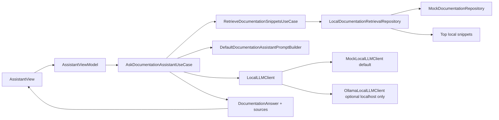
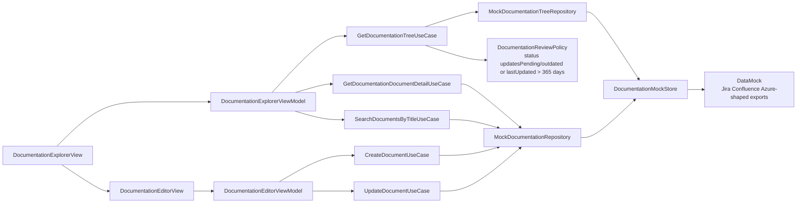

# ShellDoc Project Tree

Updated: 2026-06-06

## Overview

ShellDoc is a SwiftUI multiplatform documentation product using Clean Architecture + MVVM. Feature 01 establishes the Documentation Explorer foundation. Feature 02 adds a local-first RAG-ready Documentation Assistant prepared for Ollama on `localhost`.

## Repository Root

```
ShelEnterpriseDoc/
├── ShellDoc/                          ← Main Xcode app (iOS/iPadOS/macOS/visionOS)
│   ├── ShellDoc/                      ← App target sources (auto-discovered via PBXFileSystemSynchronizedRootGroup)
│   │   ├── Domain/                    ← Clean Architecture: Domain layer (no external deps)
│   │   │   ├── Entities/
│   │   │   │   ├── KnowledgeDocument.swift
│   │   │   │   ├── KnowledgeTicket.swift
│   │   │   │   ├── RepositoryCommit.swift
│   │   │   │   ├── ReleaseNote.swift
│   │   │   │   ├── WorkflowChange.swift
│   │   │   │   ├── DocumentOwner.swift
│   │   │   │   ├── KnowledgeSignal.swift
│   │   │   │   ├── DocumentHealthResult.swift
│   │   │   │   ├── UpdateProposal.swift
│   │   │   │   ├── AssistantAnswer.swift
│   │   │   │   ├── DocumentDraft.swift        ← in-memory editor state (new)
│   │   │   │   ├── DocumentGrouping.swift     ← Type/Platform/Owner/Status enum (new)
│   │   │   │   ├── DocumentType.swift
│   │   │   │   ├── DocumentStatus.swift
│   │   │   │   ├── Platform.swift
│   │   │   │   ├── ConfidenceLevel.swift
│   │   │   │   ├── ReviewFrequency.swift
│   │   │   │   ├── AIReviewPriority.swift
│   │   │   │   ├── TicketStatus.swift
│   │   │   │   ├── TicketType.swift
│   │   │   │   └── DocumentHealthRecommendation.swift
│   │   │   ├── Repositories/
│   │   │   │   ├── KnowledgeDocumentRepository.swift
│   │   │   │   ├── TicketRepository.swift
│   │   │   │   ├── RepositorySignalRepository.swift
│   │   │   │   ├── ReleaseRepository.swift
│   │   │   │   └── OwnerRepository.swift
│   │   │   ├── UseCases/
│   │   │   │   ├── GetDocumentsUseCase.swift
│   │   │   │   ├── GetDocumentDetailUseCase.swift
│   │   │   │   ├── SearchKnowledgeUseCase.swift
│   │   │   │   ├── EvaluateDocumentHealthUseCase.swift
│   │   │   │   ├── GetRelatedSignalsUseCase.swift
│   │   │   │   ├── GenerateUpdateProposalUseCase.swift
│   │   │   │   └── AnswerQuestionUseCase.swift
│   │   │   └── Errors/
│   │   │       └── DomainError.swift
│   │   │
│   │   ├── Data/                      ← Clean Architecture: Data layer
│   │   │   ├── DTOs/
│   │   │   │   ├── KnowledgeDocumentDTO.swift
│   │   │   │   ├── KnowledgeTicketDTO.swift
│   │   │   │   ├── RepositoryCommitDTO.swift
│   │   │   │   ├── ReleaseNoteDTO.swift
│   │   │   │   ├── WorkflowChangeDTO.swift
│   │   │   │   └── DocumentOwnerDTO.swift
│   │   │   ├── Mappers/
│   │   │   │   ├── KnowledgeDocumentMapper.swift
│   │   │   │   ├── KnowledgeTicketMapper.swift
│   │   │   │   ├── RepositoryCommitMapper.swift
│   │   │   │   ├── ReleaseNoteMapper.swift
│   │   │   │   ├── WorkflowChangeMapper.swift
│   │   │   │   └── DocumentOwnerMapper.swift
│   │   │   ├── Repositories/
│   │   │   │   ├── MockKnowledgeDocumentRepository.swift
│   │   │   │   ├── MockTicketRepository.swift
│   │   │   │   ├── MockRepositorySignalRepository.swift
│   │   │   │   ├── MockReleaseRepository.swift
│   │   │   │   └── MockOwnerRepository.swift
│   │   │   └── Local/
│   │   │       ├── MockJSONLoader.swift
│   │   │       └── Mock/
│   │   │           ├── documents.json
│   │   │           ├── tickets.json
│   │   │           ├── commits.json
│   │   │           ├── releases.json
│   │   │           ├── workflows.json
│   │   │           └── owners.json
│   │   │
│   │   ├── DesignSystem/              ← Atomic Design system
│   │   │   ├── Tokens/
│   │   │   │   └── SDColors.swift    ← Enterprise ShellDoc palette tokens
│   │   │   ├── Atoms/
│   │   │   │   ├── SDBadge.swift
│   │   │   │   ├── SDStatusChip.swift
│   │   │   │   └── SDScorePill.swift
│   │   │   ├── Molecules/
│   │   │   │   ├── SDMetadataRow.swift
│   │   │   │   ├── SDHealthScoreRow.swift
│   │   │   │   ├── SDAssistantComponents.swift
│   │   │   │   └── SDSettingsComponents.swift
│   │   │   ├── Shared/
│   │   │   │   ├── SDStateViews.swift
│   │   │   │   └── SDLottieView.swift
│   │   │   ├── Resources/
│   │   │   │   └── Lottie/assistant_knowledge_graph.json
│   │   │   └── Organisms/
│   │   │       ├── SDDocumentCard.swift
│   │   │       ├── SDHealthPanel.swift
│   │   │       └── SDDashboardMetricsSection.swift
│   │   │
│   │   ├── Presentation/              ← Clean Architecture: Presentation layer
│   │   │   ├── Navigation/
│   │   │   │   ├── AppRoute.swift               ← assistant/explorer/updatesPending/dashboard/sources/settings
│   │   │   │   └── RootNavigationView.swift     ← Assistant home, Explorer tab, DocumentByIDView
│   │   │   ├── Features/
│   │   │   │   ├── Assistant/         ← HOME — Knowledge Assistant chat
│   │   │   │   │   ├── AssistantView.swift      ← Chat + source document side panel + Lottie empty state
│   │   │   │   │   └── AssistantViewModel.swift ← chat state + selected source document loading
│   │   │   │   ├── Explorer/          ← Browse + Search unified (replaces Documents + Search)
│   │   │   │   │   ├── ExplorerView.swift       ← NavigationSplitView + DocumentReaderView
│   │   │   │   │   └── ExplorerViewModel.swift  ← grouping, search, selection
│   │   │   │   ├── Editor/            ← Obsidian-style Markdown editor (NEW)
│   │   │   │   │   ├── EditorView.swift         ← sheet, TextEditor, preview, auto-save
│   │   │   │   │   └── EditorViewModel.swift    ← DocumentDraft, isDirty, autoSave Task
│   │   │   │   ├── OutdatedReview/    ← Updates Pending documentation queue
│   │   │   │   │   ├── OutdatedReviewView.swift ← pending update list + document preview + Edit
│   │   │   │   │   └── OutdatedReviewViewModel.swift ← filters DocumentationDocument by review policy
│   │   │   │   ├── Dashboard/         ← Health metrics (secondary)
│   │   │   │   │   ├── DashboardView.swift
│   │   │   │   │   └── DashboardViewModel.swift
│   │   │   │   ├── MockSources/       ← Mock data viewer ("Sources" in nav)
│   │   │   │   │   ├── MockSourcesView.swift
│   │   │   │   │   └── MockSourcesViewModel.swift
│   │   │   │   ├── Settings/
│   │   │   │   │   └── SettingsView.swift       ← grouped enterprise settings panels
│   │   │   │   ├── Documents/         ← ORPHANED — superseded by Explorer
│   │   │   │   └── Search/            ← ORPHANED — superseded by Explorer sidebar search
│   │   │   └── Shared/
│   │   │       └── NotificationBannerView.swift ← OutdatedNotificationState + Banner + FAB (NEW)
│   │   │
│   │   ├── AppContainer.swift         ← DI root
│   │   ├── AppEnvironment.swift       ← mock mode config
│   │   └── ShellDocApp.swift          ← @main
│   │
│   ├── ShellDocTests/
│   │   ├── SearchKnowledgeUseCaseTests.swift
│   │   ├── EvaluateDocumentHealthUseCaseTests.swift
│   │   └── DashboardViewModelTests.swift
│   └── ShellDocUITests/
│
├── DS-Core/           ← Swift Package (future formal home)
├── SD-Domain/         ← Swift Package (future formal home)
├── SD-Data/           ← Swift Package (future formal home)
├── SD-Presentation/   ← Swift Package (future formal home)
├── SD-DesignSystem/   ← Swift Package (future formal home)
├── obsidian-vault/    ← Project knowledge brain
├── docs/              ← Documentation
│   └── glossary/
│       └── internal-acronyms.md
└── README.md
```

## Swift Package Tree - Feature 01 Documentation Explorer

```text
SD-Domain/
└── Sources/SD-Domain/
    ├── Entities/
    │   ├── DocumentationDocument.swift
    │   ├── DocumentationNode.swift
    │   └── DocumentationReviewPolicy.swift
    ├── Repositories/
    │   ├── DocumentationRepository.swift
    │   └── DocumentationTreeRepository.swift
    ├── UseCases/
    │   └── DocumentationExplorerUseCases.swift
    └── AppServices.swift              ← exposes Documentation Explorer use cases

SD-Data/
└── Sources/SD-Data/
    ├── Data/
    │   ├── Local/
    │   │   └── DocumentationMockStore.swift
    │   └── Repositories/
    │       ├── MockDocumentationRepository.swift
    │       └── MockDocumentationTreeRepository.swift
    └── DataMock/
        ├── DocumentationExportMock.swift
        ├── documents.json
        ├── tickets.json
        ├── commits.json
        ├── releases.json
        ├── workflows.json
        └── owners.json

SD-Presentation/
└── Sources/SD-Presentation/
    ├── Features/
    │   └── DocumentationExplorer/
    │       ├── DocumentationEditorMode.swift
    │       ├── DocumentationExplorerView.swift
    │       ├── DocumentationExplorerViewModel.swift
    │       ├── DocumentationEditorView.swift
    │       ├── MarkdownLiveEditor.swift        ← single-pane in-place Markdown editor
    │       └── DocumentationEditorViewModel.swift
    └── Navigation/
        └── RootNavigationView.swift   ← Docs route opens DocumentationExplorerView

SD-DesignSystem/
└── Sources/SD-DesignSystem/
    ├── Atoms/
    │   ├── SDPrimaryButton.swift
    │   ├── SDStatusBadge.swift
    │   └── SDTagView.swift
    ├── Molecules/
    │   ├── SDMetadataComponents.swift
    │   ├── SDSearchField.swift
    │   └── SDTreeNodeRow.swift
    ├── Organisms/
    │   └── SDTopBar.swift
    └── Shared/
        └── SDStateViews.swift

ShellDoc/
└── ShellDoc/
    └── AppContainer.swift             ← wires mock Data repositories to Domain use cases

obsidian-vault/
├── 03-features/
│   └── Documentation Explorer.md
└── 08-diagrams/
    └── Documentation Explorer Flow.md
```

## Swift Package Tree - Feature 02 Local Documentation Assistant

```text
SD-Domain/
└── Sources/SD-Domain/
    ├── Entities/
    │   ├── DocumentationAssistantEntities.swift
    │   └── DocumentationAssistantIntent.swift
    ├── Repositories/
    │   └── DocumentationAssistantRepositories.swift
    ├── UseCases/
    │   └── DocumentationAssistantUseCases.swift
    └── AppServices.swift              ← exposes askDocumentationAssistantUseCase

SD-Data/
└── Sources/SD-Data/
    └── Data/
        ├── Local/
        │   └── OllamaLocalLLMClient.swift
        └── Repositories/
            ├── LocalDocumentationRetrievalRepository.swift
            └── DocumentationAssistantRepositories.swift

SD-DesignSystem/
└── Sources/SD-DesignSystem/
    ├── Tokens/
    │   └── SDColors.swift
    ├── Shared/
    │   └── SDLottieView.swift
    ├── Molecules/
    │   ├── SDAssistantComponents.swift
    │   ├── SDMarkdownBodyView.swift
    │   └── SDSettingsComponents.swift
    └── Resources/
        └── Lottie/assistant_knowledge_graph.json

SD-Presentation/
└── Sources/SD-Presentation/
    └── Features/
        └── Assistant/
            ├── AssistantView.swift
            └── AssistantViewModel.swift

ShellDoc/
└── ShellDoc/
    ├── AppEnvironment.swift           ← Ollama base URL/model config
    └── AppContainer.swift             ← wires retrieval, prompt builder, mock/Ollama LLM
```

## Feature 02 Flow



## Feature 01 Flow



## Updates Pending Rule

`DocumentationReviewPolicy` owns the review rule:

```text
Updates Pending = document.status == updatesPending
                OR document.status == outdated
                OR document.lastUpdated is older than 365 days
```

`OutdatedReviewViewModel` exposes matching documents in the dedicated `Updates Pending` route while preserving their normal location in the documentation tree. The Documentation Explorer left panel stays focused on title search and the nested documentation tree.

## Navigation Architecture

```
iPhone (compact)          iPad/macOS (regular)
─────────────────         ──────────────────────────────
Tab 1: Assistant          Sidebar: Assistant (home)
Tab 2: Explorer                    Explorer
Tab 3: Updates Pending             Updates Pending
Tab 4: Dashboard                   ─────────────
Tab 5: More                        Dashboard
  └── Sources                      ─────────────
  └── Settings                     Sources
                                   Settings
```

## Key Changes from MVP Foundation (v1)

| Area | Before | After |
|------|--------|-------|
| Home | Dashboard | Assistant |
| Documents | `DocumentsListView` + `DocumentDetailView` | `ExplorerView` + `DocumentReaderView` |
| Search | Separate `SearchView` tab | Integrated in Explorer sidebar |
| Documentation editor | Split source/preview or none | `DocumentationEditorView` with single-pane `MarkdownLiveEditor` |
| Notifications | None | `NotificationBannerView` + `NotificationFAB` |
| Design tokens | Legacy Shell colors | `SDColors` enterprise palette plus semantic app shell, surface, text, border, status and soft-state tokens |
| Metadata | Screen-specific attribute rows | Shared `SDMetadataPanel`, `SDMetadataGrid`, `SDMetadataItem` and `SDMetadataTagGroup` |
| Nav routes | documents/documentDetail/search/mockSources | explorer/document(id)/sources |

## Architecture Layer Direction

```
Presentation → Domain ← Data
```

Feature 01 follows the same rule:

- `SD-Presentation` owns SwiftUI screens and ViewModels.
- `SD-Presentation` receives use cases from `AppServices`.
- `SD-Domain` owns documentation entities, repository protocols, and use cases.
- `SD-Data` owns mock repositories and in-memory mock storage.
- `SD-DesignSystem` owns reusable generic UI components.
