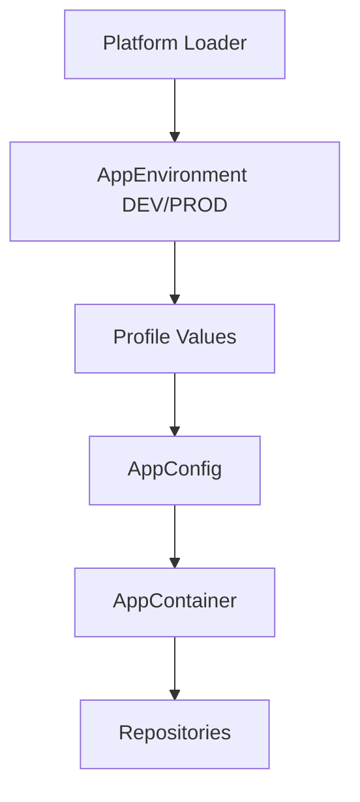

# Runtime Configuration and Release Bundles

## Summary

ShellDoc now resolves runtime configuration through a shared `AppEnvironment` contract with `DEV` and `PROD` profiles.

## Purpose

Keep the app release-ready across Android, iOS, Desktop and Web without hardcoding URLs or secrets in the codebase.

## Configuration Model

- `DEV` prefers local Supabase and local API endpoints.
- `PROD` prefers release endpoints and release tokens.
- Missing config falls back to demo mode for local development.

## Platform Resolution

- Android: `BuildConfig` values generated by `dev` and `prod` Gradle flavors.
- Desktop: root `.env` or process environment variables.
- iOS: Xcode scheme or archive environment variables.
- Web/Wasm: URL query parameters.

## Related Files

- `composeApp/src/commonMain/kotlin/com/shelldocs/app/di/AppEnvironment.kt`
- `composeApp/src/commonMain/kotlin/com/shelldocs/app/di/AppConfig.kt`
- `composeApp/src/androidMain/kotlin/com/shelldocs/app/AndroidAppConfig.kt`
- `composeApp/src/desktopMain/kotlin/com/shelldocs/app/DesktopAppConfig.kt`
- `composeApp/src/iosMain/kotlin/com/shelldocs/app/IosAppConfig.kt`
- `composeApp/src/wasmJsMain/kotlin/com/shelldocs/app/WebAppConfig.kt`
- `composeApp/build.gradle.kts`
- `.env.example`

## Data Flow

1. Platform loader reads its config source.
2. Loader resolves `DEV` or `PROD`.
3. Loader resolves profile-specific values with a common fallback.
4. `AppConfig` is passed into `App`.
5. `AppContainer` decides between demo, API or Supabase repositories.

## Mermaid Diagram

## Development Notes

- Android is the only target with native Gradle flavors.
- Desktop and iOS use runtime env injection.
- Web uses URL params because browser bundles do not have process env by default.

## Open Questions

- Should desktop and web eventually read a signed config manifest instead of raw query parameters?
- Should production bundles fail fast if required backend URLs are missing?
