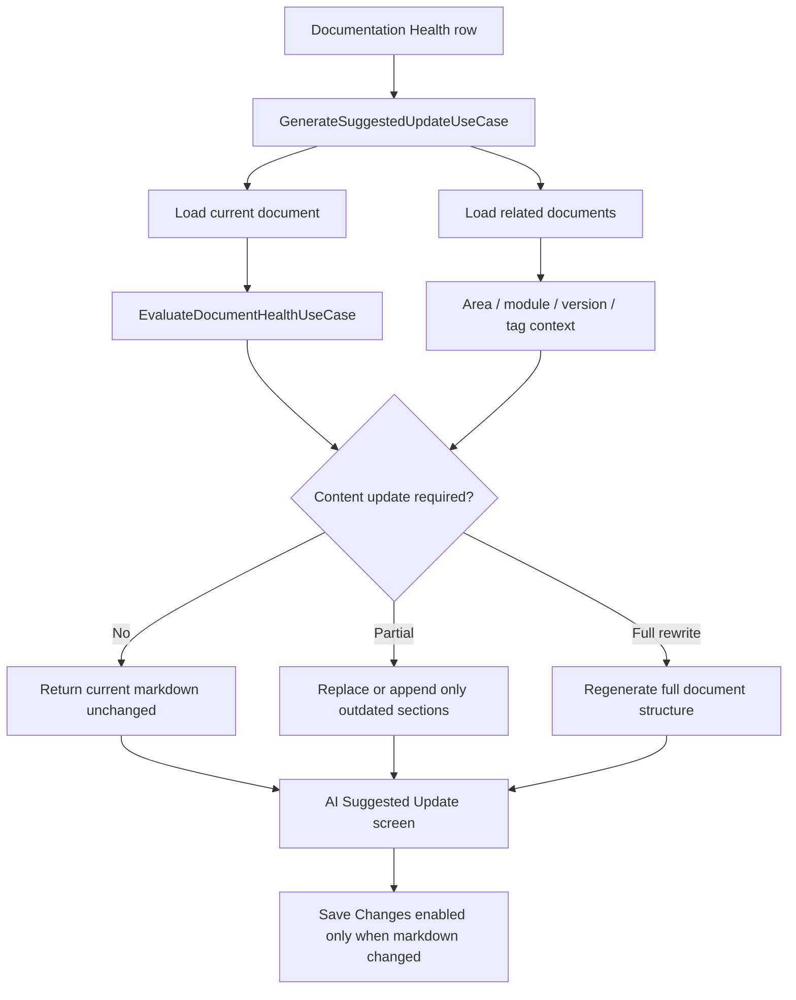

# AI Suggested Update Generation Flow

```mermaid
flowchart TD
    A["Documentation Health row"] --> B["GenerateSuggestedUpdateUseCase"]
    B --> C["Load current document"]
    B --> D["Load related documents"]
    C --> E["EvaluateDocumentHealthUseCase"]
    D --> F["Area / module / version / tag context"]
    E --> G{"Content update required?"}
    F --> G
    G -->|No| H["Return current markdown unchanged"]
    G -->|Partial| I["Replace or append only outdated sections"]
    G -->|Full rewrite| J["Regenerate full document structure"]
    H --> K["AI Suggested Update screen"]
    I --> K
    J --> K
    K --> L["Save Changes enabled only when markdown changed"]
```
