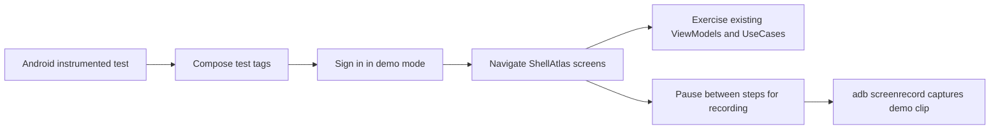

# Android Demo Test Flow

```mermaid
flowchart LR
    A["Android instrumented test"] --> B["Compose test tags"]
    B --> C["Sign in in demo mode"]
    C --> D["Navigate ShellAtlas screens"]
    D --> E["Exercise existing ViewModels and UseCases"]
    D --> F["Pause between steps for recording"]
    F --> G["adb screenrecord captures demo clip"]
```
