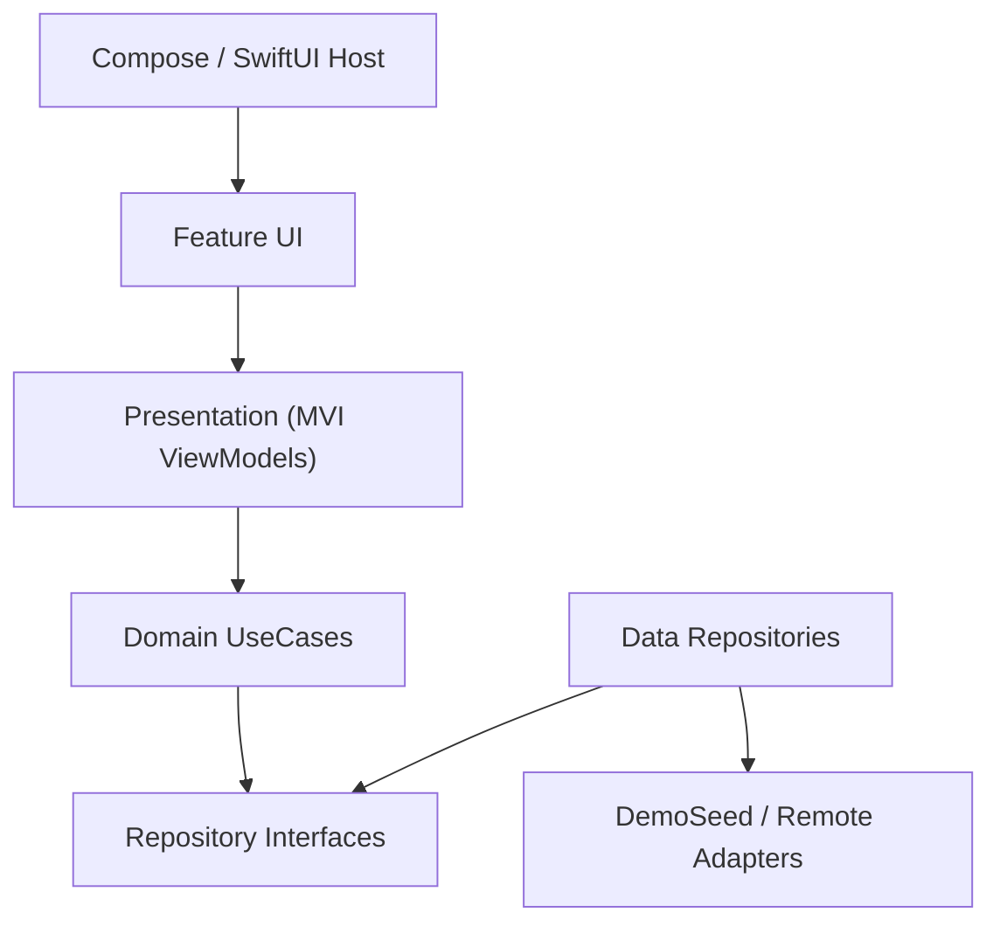

# Architecture Diagram

```mermaid
flowchart TD
    A["Compose / SwiftUI Host"] --> B["Feature UI"]
    B --> C["Presentation (MVI ViewModels)"]
    C --> D["Domain UseCases"]
    D --> E["Repository Interfaces"]
    F["Data Repositories"] --> E
    F --> G["DemoSeed / Remote Adapters"]
```
