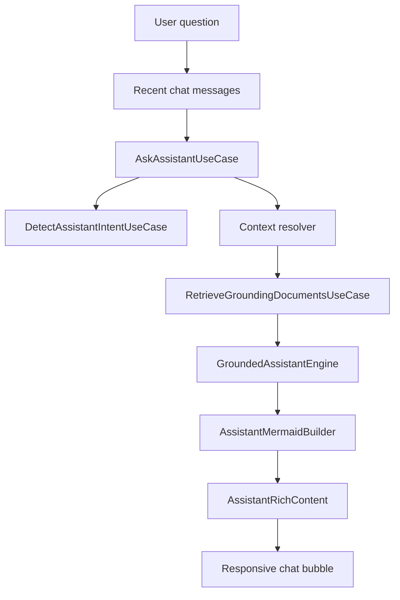
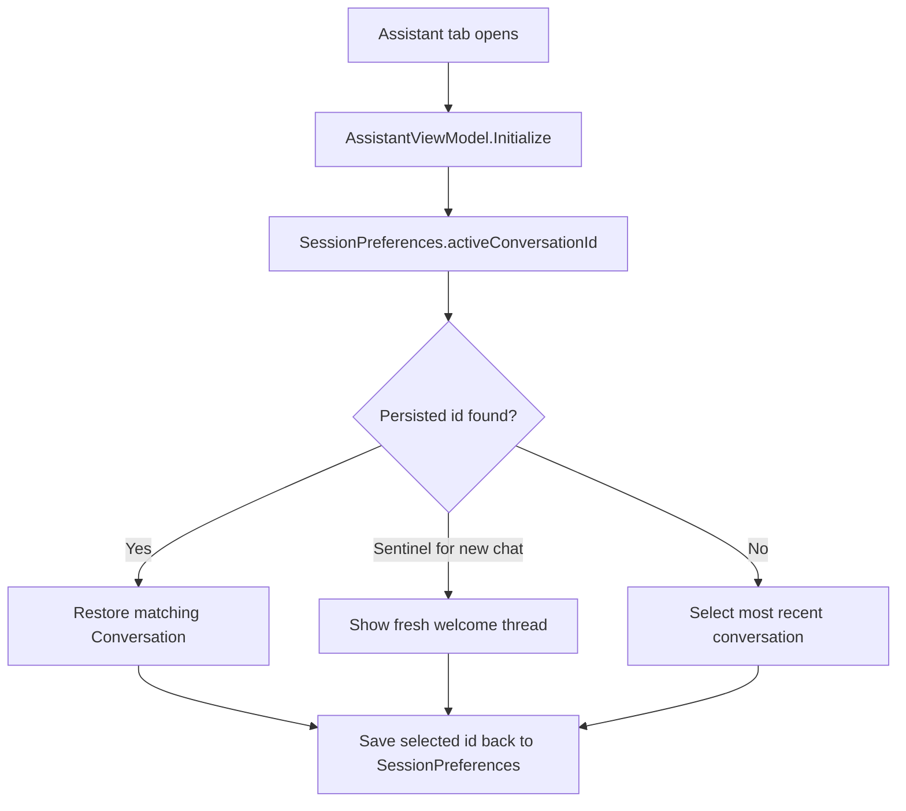
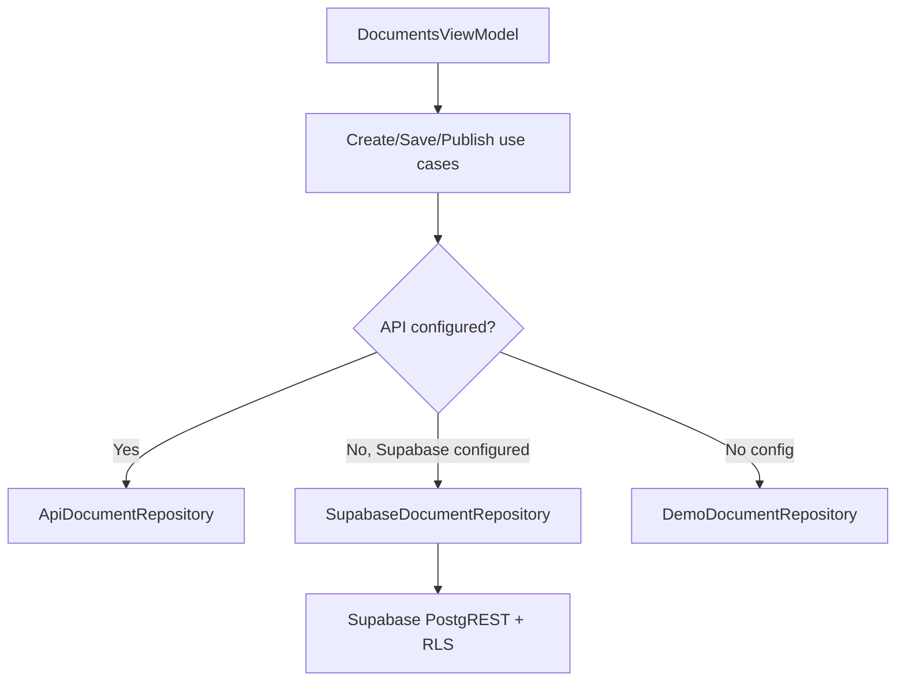

# Assistant Mermaid And Persistence Flow

## Assistant Response Flow

```mermaid
flowchart TD
    A["User question"] --> B["Recent chat messages"]
    B --> C["AskAssistantUseCase"]
    C --> D["DetectAssistantIntentUseCase"]
    C --> E["Context resolver"]
    E --> F["RetrieveGroundingDocumentsUseCase"]
    F --> G["GroundedAssistantEngine"]
    G --> H["AssistantMermaidBuilder"]
    H --> I["AssistantRichContent"]
    I --> J["Responsive chat bubble"]
```

## Conversation Restore Flow

```mermaid
flowchart TD
    A["Assistant tab opens"] --> B["AssistantViewModel.Initialize"]
    B --> C["SessionPreferences.activeConversationId"]
    C --> D{"Persisted id found?"}
    D -- Yes --> E["Restore matching Conversation"]
    D -- Sentinel for new chat --> F["Show fresh welcome thread"]
    D -- No --> G["Select most recent conversation"]
    E --> H["Save selected id back to SessionPreferences"]
    F --> H
    G --> H
```

## Document Persistence Flow

```mermaid
flowchart TD
    A["DocumentsViewModel"] --> B["Create/Save/Publish use cases"]
    B --> C{"API configured?"}
    C -- Yes --> D["ApiDocumentRepository"]
    C -- No, Supabase configured --> E["SupabaseDocumentRepository"]
    C -- No config --> F["DemoDocumentRepository"]
    E --> G["Supabase PostgREST + RLS"]
```
