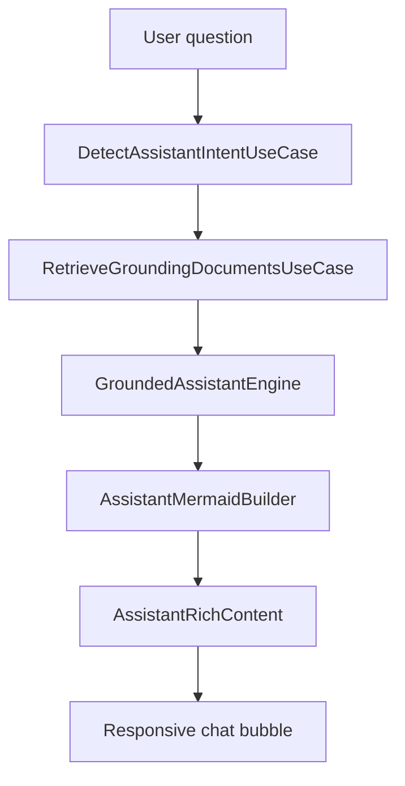
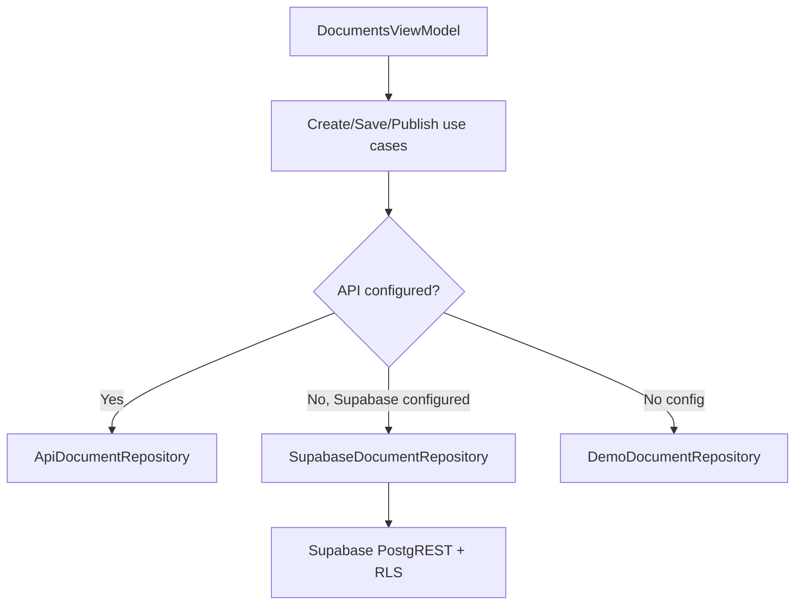

# Assistant Mermaid And Persistence Flow

## Assistant Response Flow

```mermaid
flowchart TD
    A["User question"] --> B["DetectAssistantIntentUseCase"]
    B --> C["RetrieveGroundingDocumentsUseCase"]
    C --> D["GroundedAssistantEngine"]
    D --> E["AssistantMermaidBuilder"]
    E --> F["AssistantRichContent"]
    F --> G["Responsive chat bubble"]
```

## Document Persistence Flow

```mermaid
flowchart TD
    A["DocumentsViewModel"] --> B["Create/Save/Publish use cases"]
    B --> C{"API configured?"}
    C -- Yes --> D["ApiDocumentRepository"]
    C -- No, Supabase configured --> E["SupabaseDocumentRepository"]
    C -- No config --> F["DemoDocumentRepository"]
    E --> G["Supabase PostgREST + RLS"]
```
