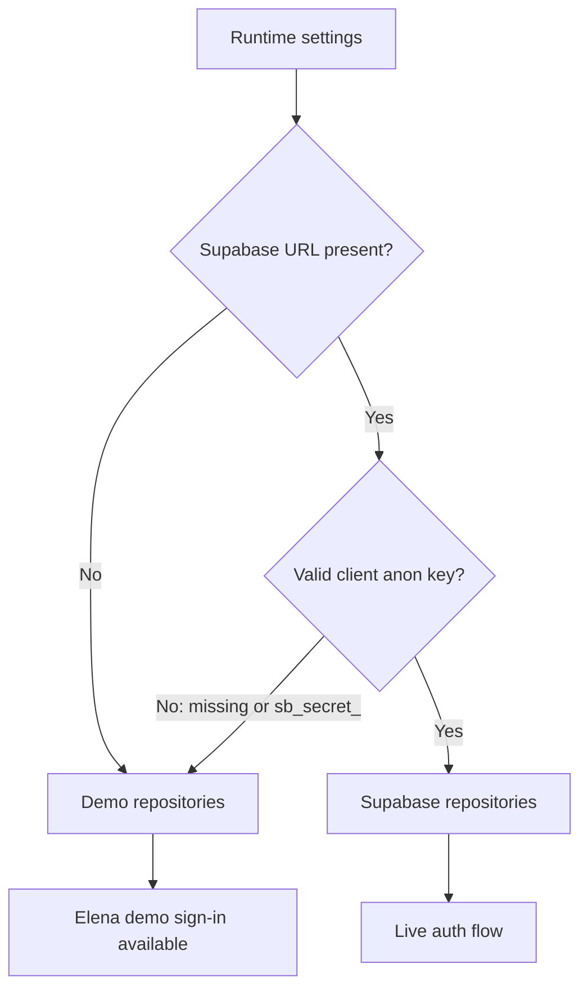

# Auth Runtime Selection Flow

```mermaid
flowchart TD
    A[Runtime settings] --> B{Supabase URL present?}
    B -->|No| C[Demo repositories]
    B -->|Yes| D{Valid client anon key?}
    D -->|No: missing or sb_secret_| C
    D -->|Yes| E[Supabase repositories]
    C --> F[Elena demo sign-in available]
    E --> G[Live auth flow]
```
