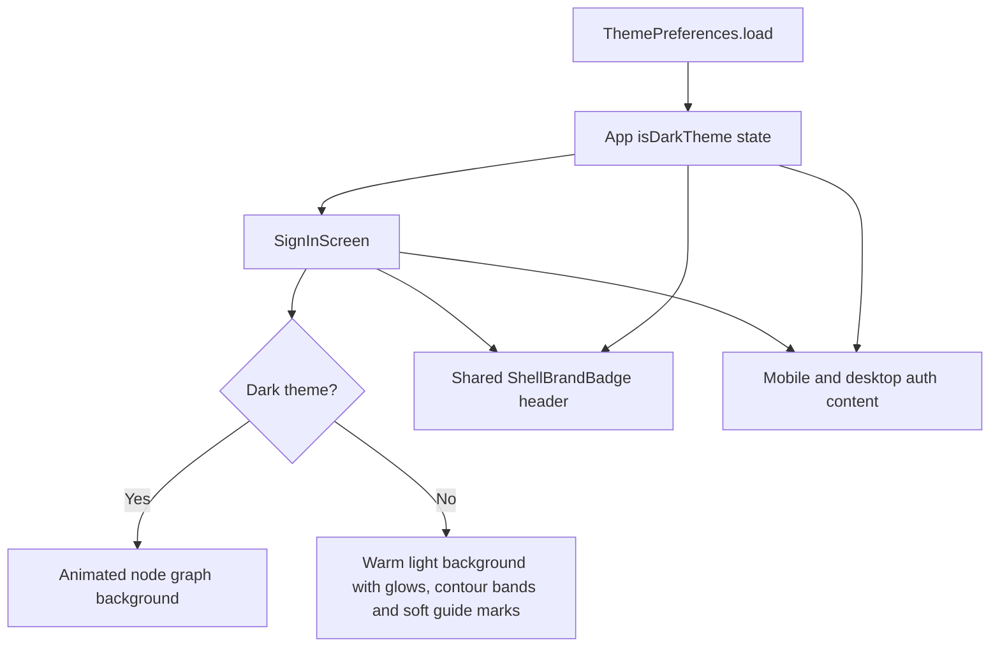

# Auth Theme Background Flow

```mermaid
flowchart TD
    A[ThemePreferences.load] --> B[App isDarkTheme state]
    B --> C[SignInScreen]
    C --> D{Dark theme?}
    D -->|Yes| E[Animated node graph background]
    D -->|No| F[Warm light background with glows, contour bands and soft guide marks]
    C --> G[Shared ShellBrandBadge header]
    C --> H[Mobile and desktop auth content]
    B --> G
    B --> H
```
