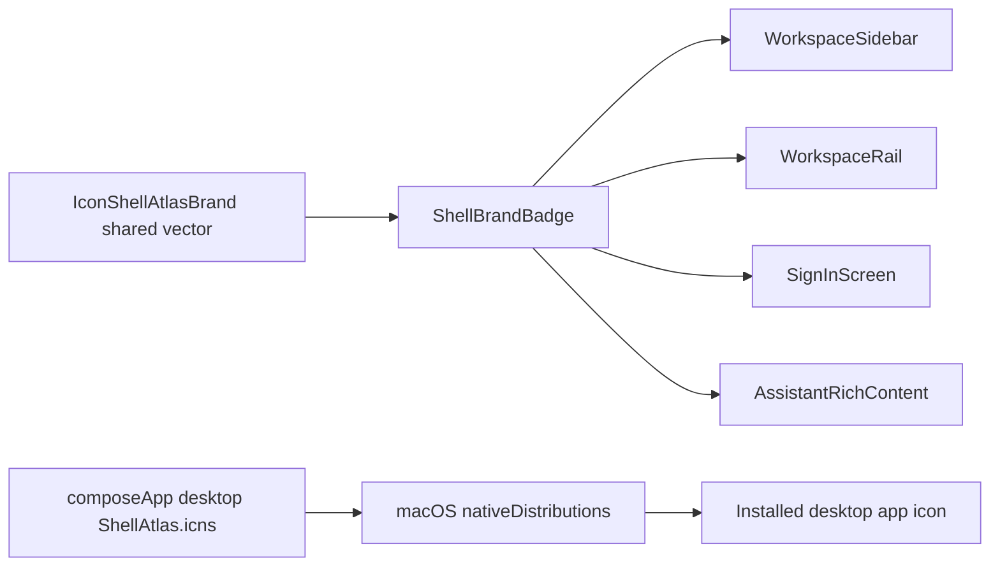

# Brand Asset Distribution Flow

```mermaid
flowchart LR
    A[IconShellAtlasBrand shared vector] --> B[ShellBrandBadge]
    B --> C[WorkspaceSidebar]
    B --> D[WorkspaceRail]
    B --> E[SignInScreen]
    B --> F[AssistantRichContent]
    G[composeApp desktop ShellAtlas.icns] --> H[macOS nativeDistributions]
    H --> I[Installed desktop app icon]
```
