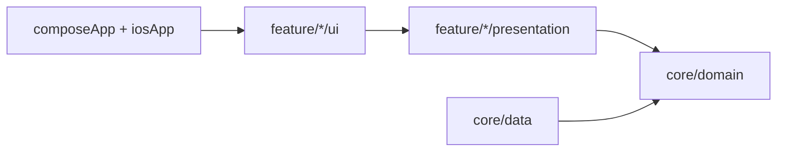

# Clean Architecture Diagram

```mermaid
flowchart LR
    UI["feature/*/ui"] --> PRESENTATION["feature/*/presentation"]
    PRESENTATION --> DOMAIN["core/domain"]
    DATA["core/data"] --> DOMAIN
    HOSTS["composeApp + iosApp"] --> UI
```
