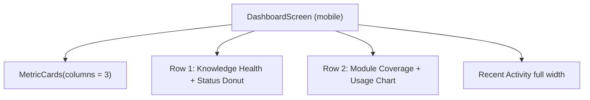

# Dashboard Mobile Layout Flow

```mermaid
flowchart TD
    A["DashboardScreen (mobile)"] --> B["MetricCards(columns = 3)"]
    A --> C["Row 1: Knowledge Health + Status Donut"]
    A --> D["Row 2: Module Coverage + Usage Chart"]
    A --> E["Recent Activity full width"]
```
