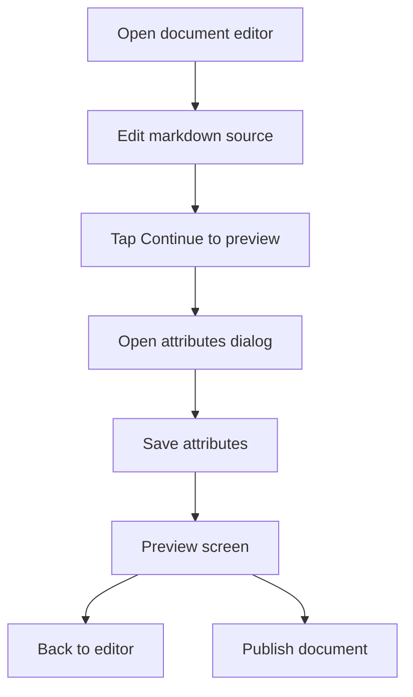

# Documents Mobile Editing Flow

```mermaid
flowchart TD
    A["Open document editor"] --> B["Edit markdown source"]
    B --> C["Tap Continue to preview"]
    C --> D["Open attributes dialog"]
    D --> E["Save attributes"]
    E --> F["Preview screen"]
    F --> G["Back to editor"]
    F --> H["Publish document"]
```
