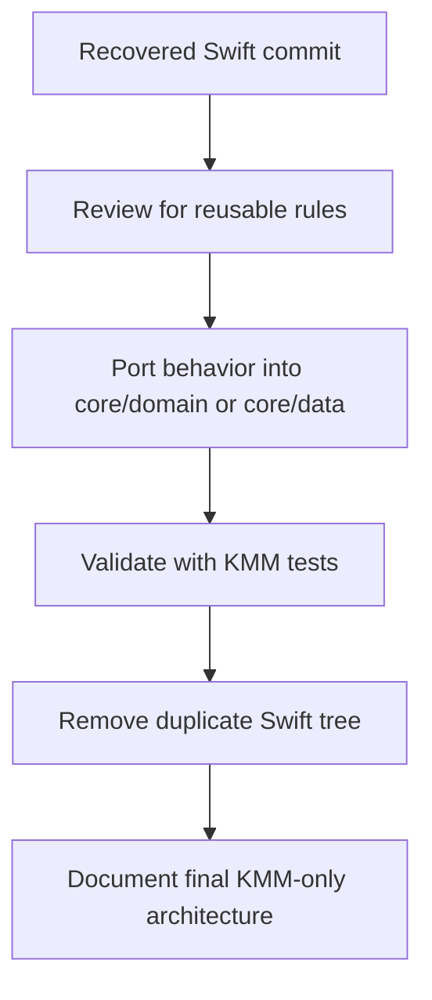

# KMM Recovery Flow

```mermaid
flowchart TD
    A["Recovered Swift commit"] --> B["Review for reusable rules"]
    B --> C["Port behavior into core/domain or core/data"]
    C --> D["Validate with KMM tests"]
    D --> E["Remove duplicate Swift tree"]
    E --> F["Document final KMM-only architecture"]
```
