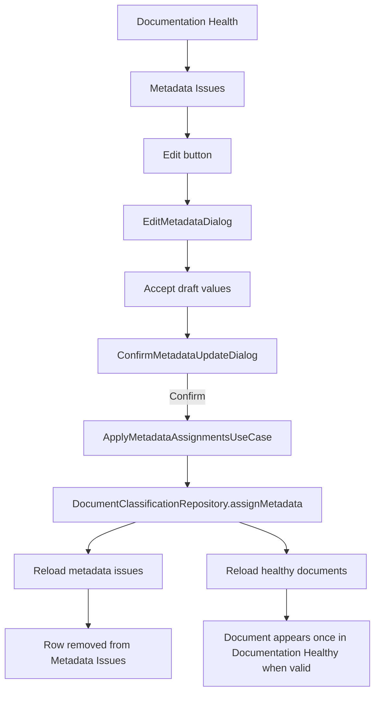

# Metadata Issues Review Flow

```mermaid
flowchart TD
    A["Documentation Health"] --> B["Metadata Issues"]
    B --> C["Edit button"]
    C --> D["EditMetadataDialog"]
    D --> E["Accept draft values"]
    E --> F["ConfirmMetadataUpdateDialog"]
    F -->|Confirm| G["ApplyMetadataAssignmentsUseCase"]
    G --> H["DocumentClassificationRepository.assignMetadata"]
    H --> I["Reload metadata issues"]
    H --> J["Reload healthy documents"]
    I --> K["Row removed from Metadata Issues"]
    J --> L["Document appears once in Documentation Healthy when valid"]
```
