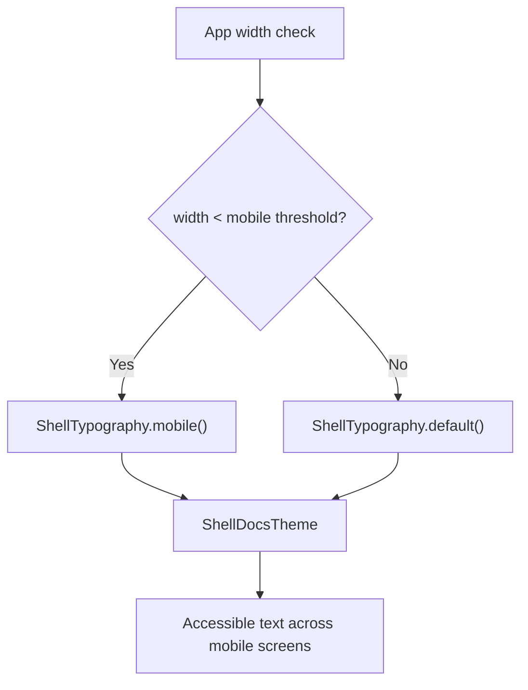

# Mobile Typography Flow

```mermaid
flowchart TD
    A["App width check"] --> B{"width < mobile threshold?"}
    B -->|Yes| C["ShellTypography.mobile()"]
    B -->|No| D["ShellTypography.default()"]
    C --> E["ShellDocsTheme"]
    D --> E
    E --> F["Accessible text across mobile screens"]
```
