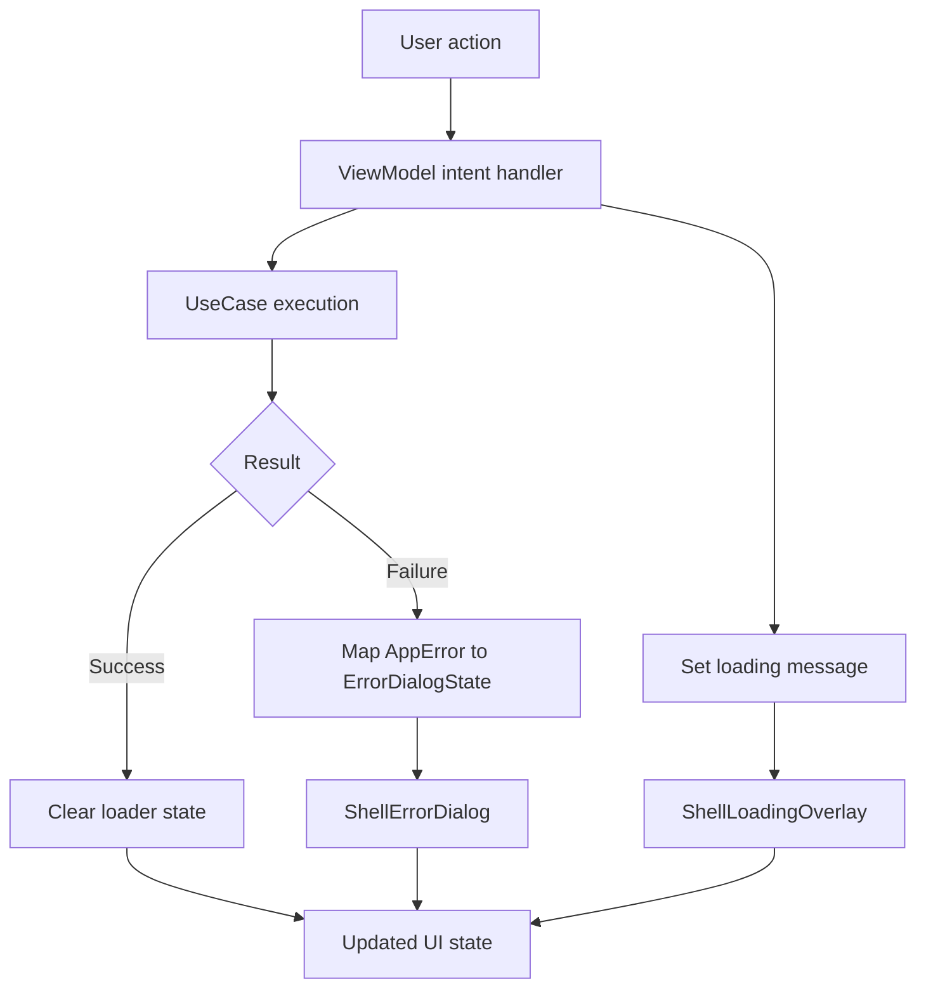

# User Feedback Flow

```mermaid
flowchart TD
    A["User action"] --> B["ViewModel intent handler"]
    B --> C["UseCase execution"]
    C --> D{"Result"}
    D -->|Success| E["Clear loader state"]
    D -->|Failure| F["Map AppError to ErrorDialogState"]
    B --> G["Set loading message"]
    G --> H["ShellLoadingOverlay"]
    F --> I["ShellErrorDialog"]
    E --> J["Updated UI state"]
    H --> J
    I --> J
```
