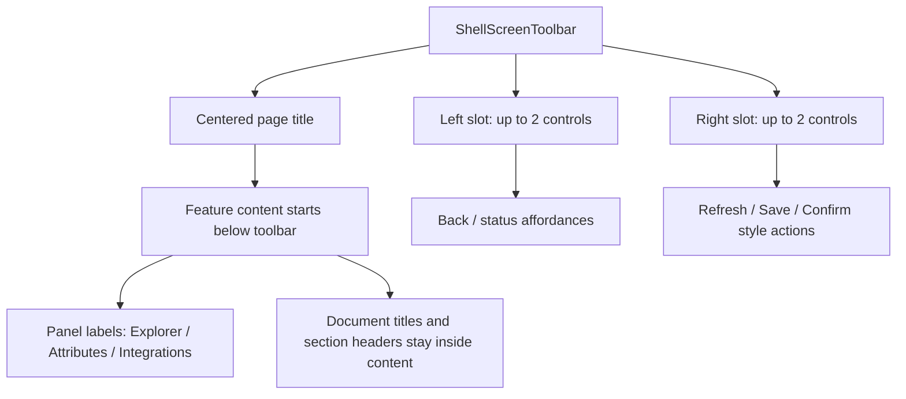

# Workspace Toolbar Hierarchy Flow

```mermaid
flowchart TD
    A["ShellScreenToolbar"] --> B["Centered page title"]
    A --> C["Left slot: up to 2 controls"]
    A --> D["Right slot: up to 2 controls"]
    B --> E["Feature content starts below toolbar"]
    E --> F["Panel labels: Explorer / Attributes / Integrations"]
    E --> G["Document titles and section headers stay inside content"]
    C --> H["Back / status affordances"]
    D --> I["Refresh / Save / Confirm style actions"]
```
