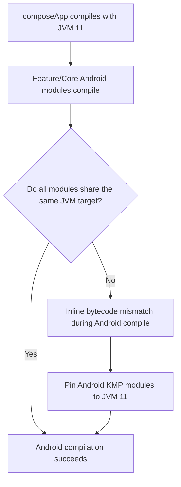

# Android Build Alignment Flow

```mermaid
flowchart TD
    A["composeApp compiles with JVM 11"] --> B["Feature/Core Android modules compile"]
    B --> C{"Do all modules share the same JVM target?"}
    C -- "No" --> D["Inline bytecode mismatch during Android compile"]
    C -- "Yes" --> E["Android compilation succeeds"]
    D --> F["Pin Android KMP modules to JVM 11"]
    F --> E
```
